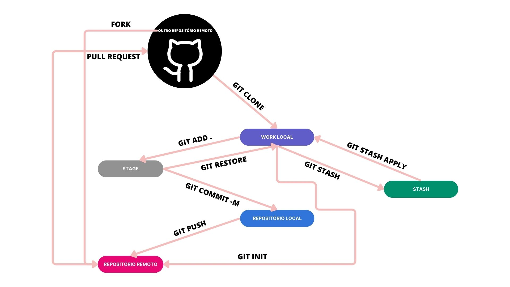

# Comandos Git e Github

### Git 


> Git é um sistema de controle de versão distribuído. Ele permite que os desenvolvedores rastreiem e gerenciem mudanças em arquivos – geralmente, mas não exclusivamente, código-fonte de programas. Aqui estão algumas características e conceitos centrais do Git:

* **Commits**: Um "snapshot" de um conjunto de mudanças nos arquivos. Cada commit tem um identificador único (um hash SHA-1).

* **Branches**: Uma linha independente de desenvolvimento. Você pode trabalhar em diferentes branches para isolar características ou correções específicas. A branch padrão é chamada "master" (ou "main" em repositórios mais recentes).

* **Merge**: O processo de combinar as mudanças de uma branch em outra.

* **Distribuído**: Cada cópia local de um repositório Git é um clone completo, contendo todo o histórico de commits. Isso permite a colaboração sem um ponto central de falha e possibilita o trabalho offline.

* **Áreas de Stage**: Antes de criar um commit, você deve adicionar (ou "stage") mudanças. Isso dá aos desenvolvedores mais controle sobre quais mudanças fazem parte de um commit.

> No diretório .git contém os metadados e objetos necessários para funcionar o git.

**config**: Contém as configurações específicas do repositório. Isso inclui informações como os remotos (por exemplo, URLs para GitHub, GitLab, etc.), preferências de branch e outras configurações específicas do repositório.

**description**: Usado principalmente pelo GitWeb para fornecer uma descrição do repositório. Por padrão, tem uma descrição genérica, e muitos repositórios não a personalizam.


**FETCH_HEAD**: Armazena informações sobre os ramos de outros repositórios que você deu git fetch recentemente. É usado internamente pelo Git para entender o que foi buscado da rede até o momento.

**HEAD**: Um ponteiro para o commit ou branch atual. Em muitos casos, aponta para o branch que você está atualmente (por exemplo, ref: refs/heads/main).

**hooks/**: Este diretório contém scripts que podem ser executados automaticamente em resposta a eventos do Git, como um commit ou um push. Estes são chamados de "hooks" (ganchos).

**index**: Armazena informações sobre o que está atualmente na sua área de staging. É uma representação binária de "o que vai no próximo commit".

**info/**: Contém o arquivo exclude, que é como um .gitignore, mas só funciona localmente (não é compartilhado com outros repositórios).

**logs/**: Registra as mudanças nos ponteiros de branch e outras atividades neste repositório.

**objects/**: Este diretório é fundamental. Ele armazena todos os commits, árvores (que correspondem a diretórios), blobs (que correspondem a arquivos) e tags. Basicamente, todos os dados do seu repositório estão em algum lugar aqui.

**packed-refs**: Uma versão compacta de referências, para economizar espaço e melhorar o desempenho.

**refs/**: Armazena ponteiros para commits. Esta é a estrutura que rastreia branches (refs/heads/), tags (refs/tags/) e remotes (refs/remotes/).


## GitHub

> GitHub é uma plataforma de hospedagem de repositórios Git. Além de hospedar código, o GitHub oferece várias outras funcionalidades para melhorar a colaboração e a gestão de projetos:

* **Pull Requests (PRs)**: Uma maneira de contribuir para repositórios de outras pessoas ou organizações. Você faz uma cópia (fork) do projeto, faz suas alterações e, em seguida, solicita que as mudanças sejam integradas ao projeto original por meio de um PR.

* **Issues**: Um sistema de rastreamento de bugs e tarefas. Pode ser usado para discutir problemas, características e planejar o desenvolvimento.

* **GitHub Actions**: Uma ferramenta de automação para CI/CD (Integração Contínua/Entrega Contínua) e outras tarefas relacionadas ao desenvolvimento.

* **Gists**: Pequenos trechos de código ou notas. Uma maneira mais informal e rápida de compartilhar código ou informações.

* **Pages**: Uma ferramenta para hospedar sites estáticos diretamente dos repositórios.

* **Integração com Terceiros**: O GitHub pode ser integrado com muitas outras ferramentas e serviços.

# Comandos git

Adicionar os arquivos na 'staging' 
> A área de Staging serve para serve para preparar as mudanças para o commit, flexibilizando as mudanças. Garantindo os commits mais limpos.

```sh
$ git add .
```

> O "commit" é uma das operações fundamentais do Git e é o mecanismo pelo qual as mudanças são registradas no histórico do repositório. 

```sh
$ git commit -m 'info do cod'
```

> O log mostra os históricos dos commits, mostrando os 40 dígitos do Hash.

> O commit é imutável, uma vez que um commit é criado, ele recebe um identificador único (SHA-1 hash).

```sh
$ git log
```

> Uma das partes mais úteis do git show é que ele exibe as mudanças introduzidas pelo commit em um formato diff. 

```sh
$ git show
```

> Caso queira ver um resumo das mudanças em vez do diff

```sh
$ git log --stat
```

> O git push é um comando utilizado para atualizar referências remotas e associar objetos confirmados (commits) ao repositório remoto.

```sh
$ git push
```

> No repositório remoto sem afetar o local pode-se usar:

```sh
$ git rm --cached arquivo.dat
```
> Deve-se commitar

```sh
$ git commit -m 'deletando arquivo.dat'
```
> Depois

```sh
$ git push
```

> O **.gitignore** é um arquivo especial usado no Git para especificar arquivos e diretórios intencionalmente não rastreados. Ou seja, serve para indicar ao Git quais arquivos ou diretórios ele deve ignorar e não considerar para o versionamento.

### Desafio
Pequeno desafio, não quero que apareça o arquivo .gitignore no
repositório remoto, como proceder? Por que isso não é recomendado?
R: Adicione o .gitignore no próprio arquivo .gitignore, isso não é recomendável, pois um **.gitignore** pode prevenir que arquivos sensíveis ou desnecessários sejam comitados acidentalmente. O que é fundamental para outros desenvolvedores, e também serve como um documentação implícita.


> Para atualizar o repositório local com as alterações feitas no repositório remoto. 

> 'git pull' é a combinação de dois comandos 'git fetch' seguido por 'git merge'. 

> **'git fetch'**: O git busca alterações feitas no repositório remoto.

> **'git merge'**: Depois de buscar as alterações, o git tenta mesclá-las com a branch atual do repositório local.


```sh
$ git pull --rebase
```

> Prune: o git removerá branches locais que não estão mais no repositório remoto. 

```sh
$ git pull --prune
```

> O 'git stash' é um comando muito útil permitindo que você salve ("stash") alterações que ainda não foram comitadas, deixando o local mais limpo, se utilizando de um sistema de pilha. 

```sh
$ git stash
```

> Para recuperar uma stash

```sh
$ git stash apply 
```

> Caso queira listar 

```sh
$ git stash list 
```

> Para deletar uma stash

```sh
$ git stash drop <nome> 
```

> Deletar todos os "stashes"

```sh
$ git stash clear 
```

```sh
$ git clone <URL do repositório>: Clona um repositório do GitHub para sua máquina local.
```

```sh
$ git pull: Obtém as alterações mais recentes do repositório remoto para o seu repositório local.
```

```sh
$ git add <arquivos>: Adiciona as alterações dos arquivos ao índice (staging area), preparando-os para o commit.
```

```sh
$ git commit -m <mensagem>: Confirma as alterações no índice com uma mensagem explicativa.
```

```sh
$ git push: Envia as alterações confirmadas para o repositório remoto.
```

```sh
$ git status: Mostra o status das alterações no seu repositório local.
```

```sh
$ git branch: Lista as branches disponíveis e indica em qual você está atualmente.
```

```sh
$ git checkout <nome da branch>: Muda para outra branch.
```

```sh
$ git merge <outra branch>: Combina as alterações de outra branch na branch atual.
```

```sh
$ git pull origin <nome da branch>: Puxa as alterações da branch remota especificada para a sua branch local.
```

```sh
$ git remote -v: Lista os repositórios remotos associados ao seu repositório local.
```

```sh
$ git log: Mostra o histórico de commits.
```

```sh
$ git reset <arquivo>: Remove as alterações do arquivo do índice, mas preserva as alterações locais.
```

```sh
$ git stash: Guarda temporariamente as alterações não confirmadas.
```

```sh
$ git stash pop: Aplica as alterações guardadas anteriormente.
```

```sh
$ git diff: Mostra as diferenças entre os arquivos no diretório de trabalho e a versão no índice.
```

```sh
$ git remote add <nome> <URL do repositório>: Adiciona um novo repositório remoto.
```

```sh
$ git remote remove <nome>: Remove um repositório remoto.
```

```sh
$ git push origin --delete <nome da branch>: Deleta uma branch remota.
```


